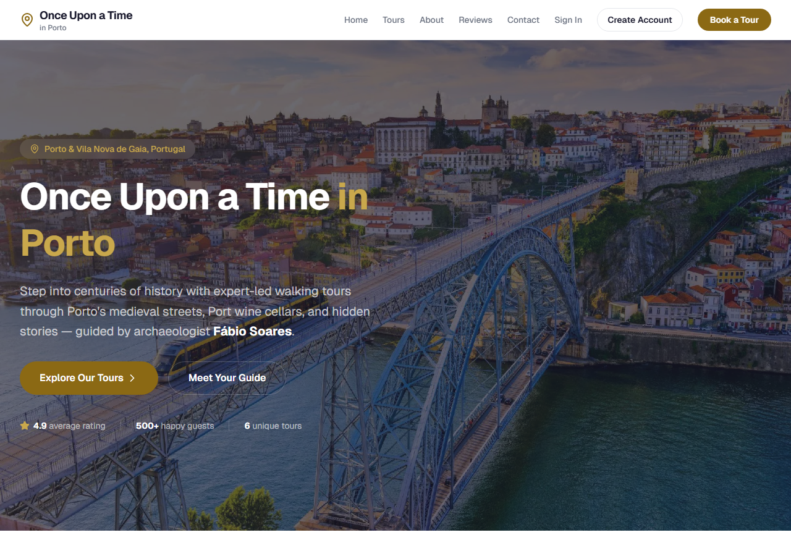
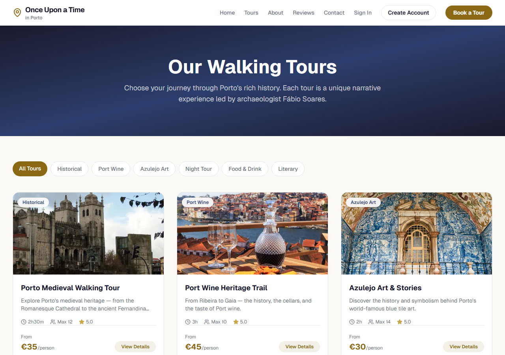
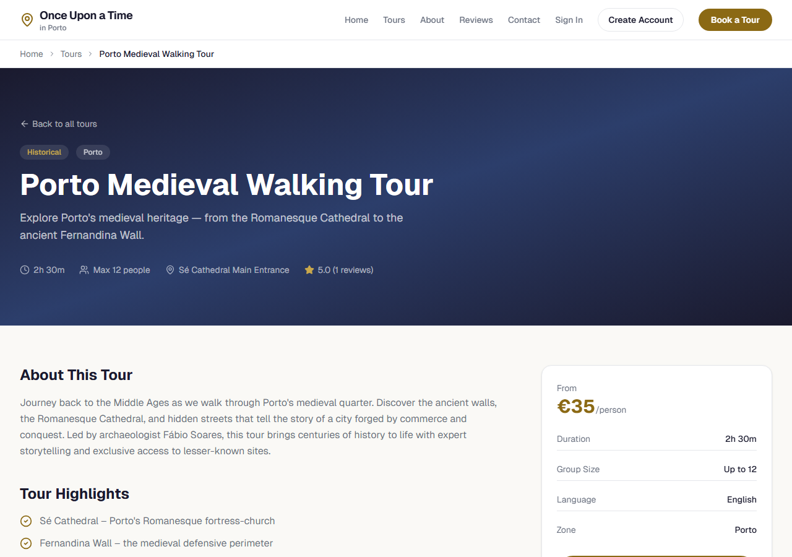
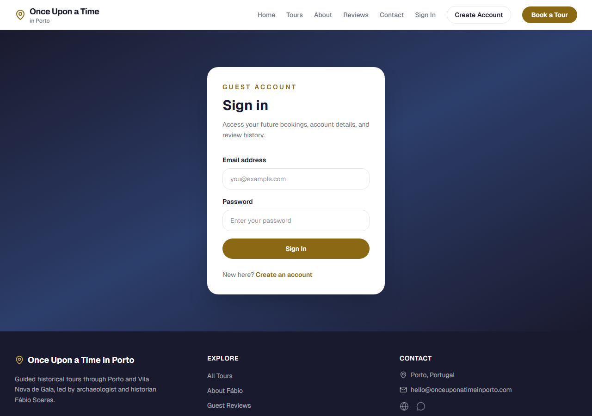

# 🏰 Once Upon a Time in Porto

> Expert-led walking tours through Porto's medieval streets, Port wine cellars, and hidden stories — guided by archaeologist Fábio Soares.

[](https://nextjs.org/)
[](https://typescriptlang.org/)
[](https://tailwindcss.com/)
[](https://supabase.com/)
[](https://react.dev/)
[](https://once-upon-porto.vercel.app/)

**🌐 [once-upon-porto.vercel.app](https://once-upon-porto.vercel.app/)**

---

## Screenshots

| Homepage | Tour Catalog |
|----------|-------------|
|  |  |

| Tour Detail | Authentication |
|------------|---------------|
|  |  |

---

## About

**Once Upon a Time in Porto** is a modern web application for a guided walking tour business in Porto and Vila Nova de Gaia, Portugal. The platform allows visitors to browse tours, read reviews, and (soon) book experiences directly online.

### Key Features

- **Tour Catalog** — Browse 6 unique tours with category filtering (Historical, Wine, Azulejo, Nocturnal, Gastronomic, Literary)
- **Tour Detail Pages** — Rich descriptions, highlights, meeting points, pricing, and guest reviews
- **About the Guide** — Bio and credentials of archaeologist Fábio Soares
- **Guest Reviews** — Testimonials with star ratings, linked to specific tours
- **Contact** — Contact form with FAQ section
- **Authentication** — Sign up, sign in, and account management via Supabase Auth
- **Route Protection** — `/account` pages protected via Next.js Proxy (middleware)
- **Responsive Design** — Mobile-first with sticky navigation and hamburger menu
- **SEO Optimized** — Full metadata, OpenGraph, semantic HTML

### Roadmap

- 💳 Stripe payment & booking system
- 📅 Calendar-based tour scheduling
- ⭐ Authenticated user review submissions
- 🛡️ Admin dashboard for tour management

---

## Tech Stack

| Layer | Technology |
|-------|-----------|
| **Framework** | Next.js 16 (App Router, Server Components, SSG) |
| **Language** | TypeScript 5 (strict mode) |
| **Styling** | Tailwind CSS 4 with CSS custom properties |
| **Database** | Supabase (PostgreSQL + Auth + RLS) |
| **Icons** | Lucide React |
| **Fonts** | Geist Sans & Geist Mono |
| **Deploy** | Vercel |

---

## Project Structure

```
src/
├── app/
│   ├── layout.tsx          # Root layout (Header + Footer)
│   ├── page.tsx            # Home (hero, tours, reviews, CTA)
│   ├── about/page.tsx      # Guide bio & philosophy
│   ├── account/page.tsx    # Protected user account page
│   ├── contact/page.tsx    # Contact form & FAQ
│   ├── login/page.tsx      # Sign in page
│   ├── reviews/page.tsx    # All guest reviews
│   ├── signup/page.tsx     # Create account page
│   ├── actions/
│   │   └── auth.ts         # Server Actions: login, signup, logout
│   └── tours/
│       ├── page.tsx        # Tour catalog with filters
│       └── [slug]/page.tsx # Tour detail (SSG)
├── components/
│   ├── layout/             # Header (server), HeaderClient (client), Footer
│   ├── reviews/            # StarRating
│   └── tours/              # TourCard
├── lib/
│   ├── auth.ts             # getAuthUser() helper
│   ├── data.ts             # Supabase data layer (with mock fallback)
│   ├── mock-data.ts        # 6 tours + 5 reviews (dev fallback)
│   └── supabase/           # Browser & server clients
├── proxy.ts                # Route protection (Next.js Proxy / Middleware)
└── types/
    └── index.ts            # Tour, Booking, Review, UserProfile
```

---

## Getting Started

### Prerequisites

- Node.js 18+
- npm or yarn

### Installation

```bash
git clone https://github.com/viniciussilva2504/once-upon-porto.git
cd once-upon-porto
npm install
```

### Environment Variables

Copy the example file and fill in your credentials:

```bash
cp .env.local.example .env.local
```

Required variables:

| Variable | Description |
|----------|-------------|
| `NEXT_PUBLIC_SUPABASE_URL` | Your Supabase project URL |
| `NEXT_PUBLIC_SUPABASE_ANON_KEY` | Supabase anonymous key |
| `NEXT_PUBLIC_APP_URL` | App URL (default: `http://localhost:3000`) |

### Development

```bash
npm run dev
```

Open [http://localhost:3000](http://localhost:3000) in your browser.

### Build

```bash
npm run build
npm start
```

---

## Architecture Decisions

- **Server Components by default** — Pages are RSC for optimal performance; `"use client"` only where needed (Header mobile menu)
- **Static Generation** — Tour detail pages use `generateStaticParams()` for fast SSG builds
- **CSS Variables + Tailwind** — Theme colors defined as CSS custom properties in `globals.css`, consumed via `@theme inline` for Tailwind v4
- **Mock-first development** — All data comes from `mock-data.ts` during development; Supabase clients are ready for production data
- **Supabase Auth + SSR** — Auth state read server-side via `@supabase/ssr`; session passed from server Header to client HeaderClient to avoid layout hydration mismatches
- **Route protection via Proxy** — Next.js 16 renamed Middleware to Proxy (`proxy.ts`); used to redirect unauthenticated users away from `/account`

---

## Author

**Vinicius Silva** — Frontend Developer
Background in Architecture · React · TypeScript · Porto, Portugal

- [Portfolio](https://portfolio-ebon-nine-95.vercel.app/)
- [LinkedIn](https://www.linkedin.com/in/vjsilva2504/)
- [GitHub](https://github.com/viniciussilva2504)

---

## License

This project is proprietary. All rights reserved.
